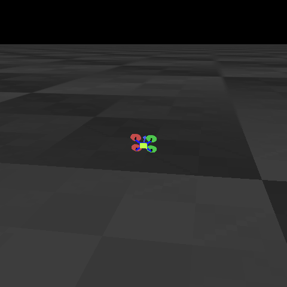
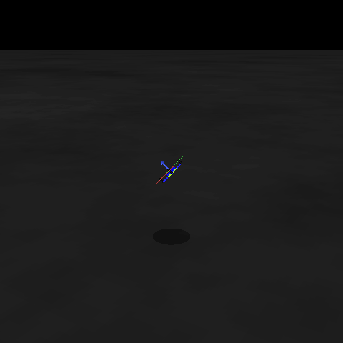
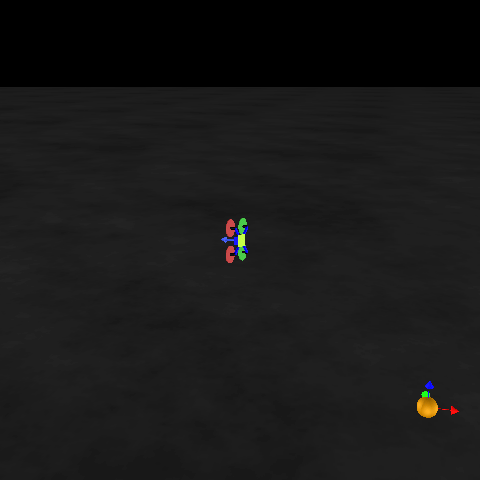

# stablebaselines3_quad_s2r

This is a repo modified from [sim2multireal](https://github.com/amolchanov86/quad_sim2multireal) project to compatible openai sb3. You can find more details in [this repo](https://github.com/amolchanov86/quad_sim2multireal).

